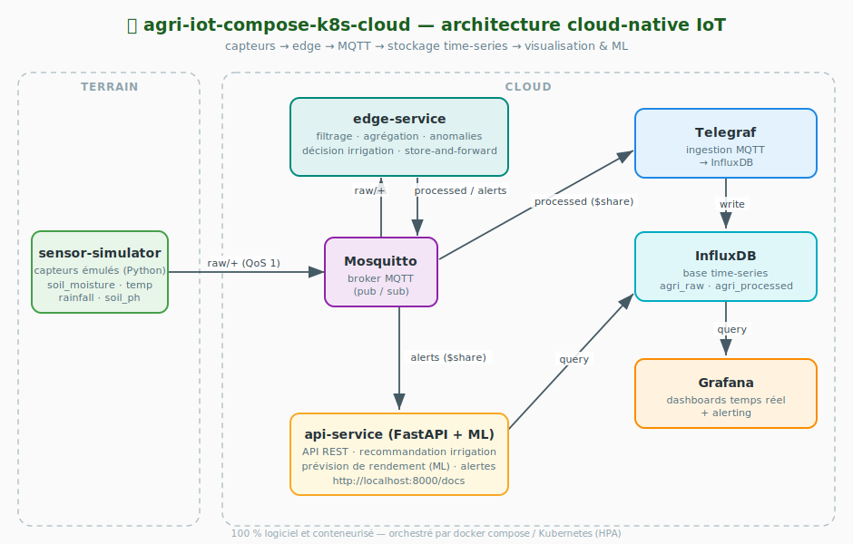

# 🌱 agri-iot-compose-k8s-cloud

> **Plateforme cloud-native d'irrigation intelligente pour l'agriculture connectée (IoT).**
> Projet final — Cloud Computing (Master / S9).
>
> Pipeline de bout en bout : **acquisition** (capteurs) → **edge computing** (filtrage / agrégation /
> décision) → **ingestion** (MQTT) → **stockage** (*time-series*) → **visualisation** →
> **aide à la décision** (recommandation d'irrigation + prévision de rendement par *machine learning*).


## Présentation

La plateforme émule un réseau de capteurs agricoles (humidité du sol, température, pluviométrie, pH),
traite les mesures à la volée dans un service *edge* conteneurisé, les ingère dans une base
*time-series*, les visualise dans Grafana et expose une **API REST** qui **recommande l'irrigation**
et **prévoit le rendement** par apprentissage automatique.

L'ensemble est **100 % logiciel et conteneurisé — aucun matériel physique requis** (les capteurs
sont des *sensor simulators*). Le dépôt est **autonome** : il se clone, se build et se déploie seul,
aussi bien en **Docker Compose** (développement) qu'en **Kubernetes** (orchestration & autoscaling).

> 💡 **Contexte métier.** L'irrigation représente l'essentiel de la consommation d'eau agricole.
> Piloter l'arrosage à partir de mesures temps réel (humidité, météo, pH) plutôt que d'un calendrier
> fixe réduit le gaspillage d'eau et améliore le rendement — c'est l'objectif fonctionnel du projet.

---

## 📑 Sommaire

1. [Prérequis](#1-prérequis)
2. [Démarrage rapide](#2-démarrage-rapide)
3. [Architecture](#3-architecture)
4. [Stack technique](#4-stack-technique)
5. [Configuration (`.env`)](#5-configuration-env)
6. [Les services en détail](#6-les-services-en-détail)
7. [Modèle de données](#7-modèle-de-données)
8. [API REST](#8-api-rest)
9. [Couche Machine Learning](#9-couche-machine-learning)
10. [Observabilité](#10-observabilité)
11. [Commandes `make`](#11-commandes-make)
12. [Scalabilité & résilience](#12-scalabilité--résilience)
13. [Déploiement Kubernetes](#13-déploiement-kubernetes)
14. [Sécurité](#14-sécurité)
15. [Arborescence](#15-arborescence)
16. [Feuille de route](#16-feuille-de-route-vers-la-production)
17. [Licence](#17-licence)

---

## 1. Prérequis

| Mode | Outils requis |
|------|---------------|
| **Docker Compose** (dev / démo) | Docker Engine ≥ 20.10 · Docker Compose v2 · GNU Make |
| **Kubernetes** (orchestration) | les outils ci-dessus **+** `kubectl` ≥ 1.27 · `kind` (ou minikube / k3d) · metrics-server (installé par `make k8s-metrics`) |
| **Optionnel** | `curl` + Python 3 pour `make demo` ; le `make loadtest` s'exécute **en conteneur** — aucune dépendance Python (ni `paho-mqtt`) à installer sur l'hôte |

> Toutes les commandes `make` s'utilisent **depuis la racine du dépôt**. Le détail du mode Kubernetes
> (cluster kind, HPA, probes, PVC) est documenté dans [`deploy/k8s/README.md`](deploy/k8s/README.md).

---

## 2. Démarrage rapide

Depuis un poste disposant de Docker (cf. [§1 Prérequis](#1-prérequis)) :

```bash
git clone git@github.com:Santatriniainaa/agri-iot-compose-k8s-cloud.git
cd agri-iot-compose-k8s-cloud
cp .env.example .env          # ajuste les paramètres si besoin
make up                       # build + démarrage de la stack
```

> Le fichier compose est sous `deploy/compose/` ; `make` l'invoque avec `--project-directory .` pour garder
> les chemins `./services` et `./infra` relatifs à la racine.
> Équivalent direct : `docker compose -f deploy/compose/docker-compose.yml --project-directory . up -d --build`.

Patienter ~30–60 s (build + initialisation d'InfluxDB et entraînement du modèle ML), puis :

| Service | URL | Identifiants |
|---------|-----|--------------|
| **PWA mobile** | http://localhost:8080 | `agri` / `${API_AUTH_PASSWORD}` (défaut `agri-iot-demo`) |
| API (Swagger) | http://localhost:8000/docs | — (auth JWT sur `/api/v1`) |
| Grafana | http://localhost:3000 | `admin` / `${GRAFANA_PASSWORD}` |
| InfluxDB | http://localhost:8086 | `admin` / `${INFLUX_PASSWORD}` |

Le dashboard **« agri-iot-compose-k8s-cloud — Supervision des parcelles »** est déjà provisionné dans Grafana.

### Vérifier que tout fonctionne

```bash
make smoke      # test de bout en bout automatisé (5 étapes)
# … ou manuellement :
curl http://localhost:8000/health
curl http://localhost:8000/api/parcels
curl http://localhost:8000/api/recommend/zoneA
curl http://localhost:8000/api/predict/yield/zoneA
```

---

## 3. Architecture



<details>
<summary>📐 Version ASCII (rendu terminal)</summary>

```
┌──────────────────────────────────────────────────────────────────────────────┐
│                      docker compose  (réseau « agri-iot-compose-k8s-cloud »)   │
│                                                                                │
│  ┌────────────────────┐   MQTT    ┌──────────────┐                             │
│  │ sensor-simulator   │  raw/+    │  edge-service │  filtrage / agrégation /    │
│  │ (Python, paho-mqtt)│ ────────► │  (Python)     │  anomalies / décision       │
│  │  soil_moisture     │           └──────┬───────┘  store-and-forward          │
│  │  temperature       │                  │ processed / alerts                  │
│  │  rainfall          │                  ▼                                     │
│  │  soil_ph           │           ┌──────────────┐                             │
│  └────────────────────┘           │  Mosquitto   │  broker MQTT                │
│                                    └──────┬───────┘                             │
│                                           │ subscribe ($share/...)              │
│                          ┌────────────────┼─────────────────┐                  │
│                          ▼                ▼                 ▼                  │
│                   ┌────────────┐   ┌────────────┐    ┌──────────────┐          │
│                   │  Telegraf  │   │ api-service│    │  (alerts →    │          │
│                   │ MQTT→Influx│   │ (FastAPI + │    │  api-service) │          │
│                   └─────┬──────┘   │  sklearn)  │    └──────────────┘          │
│                         ▼          └─────┬──────┘                              │
│                   ┌────────────┐         │ query                               │
│                   │  InfluxDB  │ ◄───────┘                                     │
│                   │ time-series│ ◄───────┐                                     │
│                   └────────────┘         │ query                               │
│                                    ┌──────┴───────┐                            │
│                                    │   Grafana    │  dashboards temps réel     │
│                                    └──────────────┘                            │
└──────────────────────────────────────────────────────────────────────────────┘
```

</details>

### 3.1 Pipeline de données

| Étape | Mécanisme | Détail |
|-------|-----------|--------|
| **Acquisition** | `sensor-simulator` → MQTT `agri/<site>/<parcel>/raw/<type>` · `weather-service` → MQTT `agri/<site>/meteo` | mesures sol brutes (modèle agronomique) + météo réelle Open-Meteo (fallback synthétique) |
| **Edge** | `edge-service` agrège par fenêtre glissante (`WINDOW_SECONDS`) | filtrage hors-plage, anomalies, **décision d'irrigation déterministe** |
| **Re-publication** | MQTT `…/processed` et `…/alerts` | mesures agrégées + recommandations |
| **Ingestion** | `telegraf` consomme MQTT → InfluxDB | parse JSON, tags `site`/`parcel`/`source`, mesures `agri_raw` / `agri_processed` / `agri_weather` |
| **Stockage** | `influxdb` *time-series* | bucket `telemetry` (30 j) + downsampling horaire → `telemetry_downsampled` (90 j) |
| **Restitution** | `grafana` (dashboards) · `api-service` (REST/ML) | requêtes Flux ; l'API souscrit aussi aux `…/alerts` |

### 3.2 Inventaire des services

| # | Service | Image / langage | Port | Rôle |
|---|---------|-----------------|------|------|
| 1 | `sensor-simulator` | Python 3.12 + paho-mqtt | — | Émule les capteurs, publie en MQTT (`raw/<type>`) — **stateless, réplicable** |
| 2 | `weather-service` | Python 3.12 + paho-mqtt + requests | — | Interroge l'**API Open-Meteo** (sans clé), publie la météo du site (`meteo`) — **fallback synthétique** si hors-ligne |
| 3 | `edge-service` | Python 3.12 + paho-mqtt | — | Agrégation fenêtrée, anomalies, décision d'irrigation, store-and-forward |
| 4 | `mosquitto` | eclipse-mosquitto:2 | 1883 / 9001 | Broker MQTT (pub/sub), auth login/mdp, persistance |
| 5 | `telegraf` | telegraf:1.30 | — | Ingestion MQTT → InfluxDB (trois consumers : raw + processed + weather) |
| 6 | `influxdb` | influxdb:2.7 | 8086 | Base *time-series* + rétention/downsampling |
| 7 | `api-service` | FastAPI + scikit-learn | 8000 | API REST versionnée (`/api/v1`, auth JWT, CORS) : état, recommandation, prévision ML, alertes, **vue d'ensemble agrégée** |
| 8 | `grafana` | grafana:11.1 | 3000 | Tableaux de bord temps réel (provisionnés) : *Supervision des parcelles* + **`agri-api-meteo`** |
| 9 | `pwa` | Angular 20 + Nginx | 8080 | **Application mobile** (PWA installable) : consultation parcelles, historique, recommandations, alertes — **stateless, réplicable** |

> Un service one-shot **`influx-init`** (image `influxdb:2.7`) s'exécute une fois après qu'InfluxDB
> est sain pour créer — de façon idempotente — le bucket downsamplé et la *task* Flux d'agrégation.

### 3.3 Couches d'infrastructure

| Couche | Rôle | Composants |
|--------|------|------------|
| **Acquisition** | émulation capteurs, publication MQTT | `sensor-simulator` |
| **Edge** | filtrage, agrégation, anomalies, décision, *store-and-forward* | `edge-service` |
| **Messagerie** | bus pub/sub découplant producteurs et consommateurs | `mosquitto` |
| **Stockage & ingestion** | persistance *time-series* + rétention/downsampling | `telegraf` → `influxdb` |
| **Restitution** | dashboards temps réel + API REST/ML | `grafana`, `api-service` |

### 3.4 Modes de déploiement

| | **Docker Compose** (dev) | **Kubernetes** (orchestration) |
|---|--------------------------|--------------------------------|
| **Cible** | poste local, démo rapide | cluster (kind / minikube / k3d) |
| **Définition** | [`deploy/compose/docker-compose.yml`](deploy/compose/docker-compose.yml) | [`deploy/k8s/`](deploy/k8s/) (kustomize) |
| **Config / secrets** | `.env` | `ConfigMap` + `Secret` |
| **Persistance** | volumes Docker | `PersistentVolumeClaim` |
| **Mise à l'échelle** | `--scale` (manuel) | **HPA** (autoscaling CPU) + probes, requests/limits |
| **Réseau** | bridge `agri-iot-compose-k8s-cloud` | `Service` (ClusterIP / NodePort) |
| **Lancement** | `make up` | `make k8s-up` |

> Les images applicatives portent un tag unique (`agri-iot-compose-k8s-cloud/<svc>:latest`) **partagé**
> entre Compose et Kubernetes : un seul `make build` alimente les deux infrastructures.

---

## 4. Stack technique

| Domaine | Technologie | Version | Justification |
|---------|-------------|---------|---------------|
| Conteneurisation | Docker + Compose v2 | ≥ 20.10 / ≥ 2.0 | reproductibilité, isolation |
| Orchestration | Kubernetes + Kustomize | ≥ 1.27 | autoscaling (HPA), probes, déclaratif |
| Messagerie | Eclipse Mosquitto | 2.x | broker MQTT léger, *shared subscriptions* |
| Ingestion | Telegraf | 1.30 | connecteur MQTT→InfluxDB sans code |
| Stockage | InfluxDB | 2.7 | *time-series*, Flux, rétention/downsampling natifs |
| Visualisation | Grafana | 11.1 | dashboards provisionnés « as code » |
| API | FastAPI + Uvicorn | 0.111 / 0.30 | async, validation, OpenAPI/Swagger auto |
| ML | scikit-learn | 1.5 | `RandomForestRegressor` (prévision de rendement) |
| Runtime | Python | 3.12-slim | images légères, non-root |
| Client MQTT | paho-mqtt | 2.1 | pub/sub QoS 1, reconnexion |

---

## 5. Configuration (`.env`)

Toute la configuration passe par variables d'environnement (cf. [`.env.example`](.env.example)).
En Kubernetes, les mêmes clés sont portées par un `ConfigMap` (non sensible) et un `Secret`.

| Variable | Défaut | Service | Rôle |
|----------|--------|---------|------|
| `INFLUX_ORG` | `agri-iot-compose-k8s-cloud` | influxdb, telegraf, api, grafana | organisation InfluxDB |
| `INFLUX_BUCKET` | `telemetry` | idem | bucket *time-series* principal |
| `INFLUX_TOKEN` | *(démo)* | idem | jeton admin InfluxDB |
| `INFLUX_USERNAME` / `INFLUX_PASSWORD` | `admin` / *(démo)* | influxdb | identifiants console InfluxDB |
| `INFLUX_RETENTION` | `30d` | influxdb | rétention du bucket brut (`0s` = infini) |
| `INFLUX_DOWNSAMPLE_RETENTION` | `90d` | influx-init | rétention du bucket downsamplé |
| `GRAFANA_USER` / `GRAFANA_PASSWORD` | `admin` / *(démo)* | grafana | identifiants admin Grafana |
| `MQTT_HOST` / `MQTT_PORT` | `mosquitto` / `1883` | edge, sim, api, telegraf | adresse du broker |
| `MQTT_USERNAME` / `MQTT_PASSWORD` | *(démo)* | tous | auth MQTT (login/mot de passe) |
| `SITE` | `farm01` | simulator | identifiant du site/exploitation |
| `PARCELS` | `zoneA,zoneB,zoneC` | simulator | parcelles simulées (CSV) |
| `PUBLISH_INTERVAL` | `2` | simulator | secondes entre deux salves de mesures |
| `ANOMALY_PROB` | `0.01` | simulator | probabilité d'injecter une anomalie |
| `WINDOW_SECONDS` | `5` | edge | fenêtre d'agrégation glissante (alignée 5 s : Telegraf + refresh Grafana) |
| `MOISTURE_THRESHOLD` | `30` | edge | %VWC sous lequel irriguer |
| `RAIN_SKIP_MM` | `2` | edge | pluie cumulée annulant l'irrigation |

---

## 6. Les services en détail

### 6.1 `sensor-simulator` — émulation des capteurs

Génère des séries **réalistes** via un modèle agronomique simplifié, état mémorisé par parcelle :

- **Température** : cycle diurne (sinusoïde 24 h) + bruit gaussien, déphasage propre à chaque parcelle.
- **Humidité du sol** : assèchement permanent (drainage + absorption racinaire) + **évapotranspiration**
  (↑ avec la température), contre **réhydratation** par la pluie → cycle réaliste qui descend sous le
  seuil et déclenche l'irrigation (au lieu de saturer).
- **Pluviométrie** : événements aléatoires (probabilité `RAIN_EVENT_PROB`), 0.5–12 mm.
- **pH** : marche aléatoire lente bornée ; **batterie** : décharge monotone.
- **Anomalies** : injection occasionnelle (`ANOMALY_PROB`) de valeurs aberrantes pour exercer l'edge.

Stateless → on **réplique le conteneur** pour simuler plus de capteurs. Publie sur
`agri/<site>/<parcel>/raw/<type>` en QoS 1.

### 6.2 `edge-service` — *edge computing* logiciel

Cœur du traitement temps réel, **sans état durable** (cache mémoire uniquement) donc réplicable :

- **Abonnement partagé** `$share/edge/agri/+/+/raw/+` → avec plusieurs réplicas, le broker répartit
  les messages (pas de doublons).
- **Filtrage** : chaque valeur hors plage physique (`VALID_RANGES`) est écartée des moyennes.
- **Détection d'anomalies** : valeur hors plage **ou** capteur « figé » (variance nulle sur ≥ 8 échantillons).
- **Agrégation** : toutes les `WINDOW_SECONDS`, moyenne/min/somme par parcelle sur la fenêtre (+ marge 1.5×).
- **Décision d'irrigation** (règle déterministe, explicable) :

  ```
  si pluie_cumulée > RAIN_SKIP_MM      → pas d'irrigation
  sinon si humidité < MOISTURE_THRESHOLD :
        déficit  = seuil − humidité
        minutes  = clamp(déficit × 3, 5, 60)
        volume   = déficit × 0.3  (L/m²)
  ```

- **Store-and-forward** : si le broker tombe, les messages sont mis en file (`deque` 10 000) et
  **rejoués à la reconnexion** ; arrêt propre sur `SIGTERM`/`SIGINT`.

Publie `…/processed` (→ Telegraf) et `…/alerts` (→ api-service).

### 6.3 `mosquitto` — broker MQTT

Listeners `1883` (MQTT) et `9001` (WebSocket). **`allow_anonymous false`** : un `password_file` hashé
est généré au démarrage depuis `MQTT_USERNAME`/`MQTT_PASSWORD` (régénération idempotente). Persistance activée.

### 6.4 `telegraf` — ingestion

Deux entrées `mqtt_consumer` en **shared subscription** (répartissables) :
`…/processed` → mesure `agri_processed`, `…/raw/+` → mesure `agri_raw`. Sortie `influxdb_v2`.

### 6.5 `influxdb` (+ `influx-init`) — stockage *time-series*

Initialisé en mode `setup` (org, bucket, token, rétention). Le job one-shot **`influx-init`** crée le
bucket `telemetry_downsampled` et une **task Flux** `downsample_agri_processed_1h` (moyennes horaires) —
idempotents.

### 6.6 `api-service` — API REST + ML

FastAPI + Uvicorn. Au démarrage (`entrypoint.sh`) : entraîne le modèle ML s'il est absent, puis sert
l'API. Un **thread d'arrière-plan** souscrit aux `agri/+/+/alerts` et garde les 200 dernières en mémoire.
Conteneur non-root, `HEALTHCHECK` intégré.

L'API est structurée en packages (`core/`, `security/`, `schemas/`, `routers/`) et **versionnée** :
les routes sont servies sous **`/api/v1`** (protégées par **JWT**, cible de la PWA) et, en **alias
rétro-compatible**, sous `/api` (ouvert — Grafana, scripts, `make smoke`). `CORSMiddleware` autorise
le navigateur ; l'endpoint agrégé **`/api/v1/overview`** renvoie le résumé de toutes les parcelles en
un seul appel (optimisé mobile). Tests : **`make test-api`** (pytest).

### 6.7 `pwa` — application mobile (PWA Angular)

Client **mobile-first** en **Angular 20** (standalone, lazy-loading, *signals*), installable et
utilisable hors-ligne grâce au **service worker** (`@angular/service-worker`). Écrans : **connexion**
(JWT), **tableau de bord** (KPI agrégés + *pull-to-refresh*), **détail parcelle** (recommandation,
rendement ML, historique en graphe SVG), **alertes**. Bannière hors-ligne et invite de mise à jour.

Build **multi-stage** (Node 20 → **Nginx non-root**, uid 101, port 8080). L'URL de l'API est injectée
**au runtime** dans `config.json` par l'entrypoint Nginx (variable `API_BASE_URL`) : la **même image**
sert ainsi en Docker Compose et en Kubernetes sans recompilation. Stateless → réplicable (Service + HPA).

> Identifiants de démonstration : `agri` / `agri-iot-demo` (paramétrables via `API_AUTH_USER` /
> `API_AUTH_PASSWORD`).

---

## 7. Modèle de données

### 7.1 Topics MQTT

```
agri/<site>/<parcel>/raw/<type>     # mesures brutes (simulateur → edge, telegraf)
agri/<site>/<parcel>/processed      # mesures agrégées + décision (edge → telegraf)
agri/<site>/<parcel>/alerts         # alertes / recommandations (edge → api-service)
agri/<site>/meteo                   # météo du site Open-Meteo (weather → telegraf, mesure agri_weather)
```

### 7.2 Messages

<details>
<summary><strong>Message brut</strong> (<code>…/raw/soil_moisture</code>)</summary>

```json
{ "sensor_id": "farm01-zoneA-soil_moisture", "type": "soil_moisture",
  "site": "farm01", "parcel": "zoneA", "value": 27.4, "unit": "%VWC",
  "battery": 92.0, "quality": "ok", "ts": "2026-06-05T08:15:00Z" }
```
</details>

<details>
<summary><strong>Message agrégé</strong> (<code>…/processed</code>)</summary>

```json
{ "site": "farm01", "parcel": "zoneA", "window_s": 10, "samples": 18,
  "soil_moisture_avg": 28.1, "soil_moisture_min": 26.9, "temperature_avg": 24.7,
  "rainfall_sum": 0.0, "soil_ph_avg": 6.3, "irrigation_needed": 1,
  "irrigation_minutes": 20, "irrigation_volume_l_m2": 1.5, "anomaly": 0,
  "ts": "2026-06-05T08:20:00Z" }
```
</details>

<details>
<summary><strong>Alerte</strong> (<code>…/alerts</code>)</summary>

```json
{ "site": "farm01", "parcel": "zoneA", "level": "warning",
  "reason": "humidité 24.1% < seuil 30% et pluie 0.0 mm",
  "recommendation": { "action": "irrigate", "minutes": 18, "volume_l_m2": 1.77 },
  "ts": "2026-06-05T08:20:00Z" }
```
</details>

### 7.3 Schéma InfluxDB

| Measurement | Tags | Champs principaux |
|-------------|------|-------------------|
| `agri_raw` | `site`, `parcel`, `type`, `sensor_id` | `value`, `battery` |
| `agri_processed` | `site`, `parcel` | `soil_moisture_avg`, `soil_moisture_min`, `temperature_avg`, `rainfall_sum`, `soil_ph_avg`, `irrigation_needed`, `irrigation_minutes`, `irrigation_volume_l_m2`, `anomaly`, `samples` |

---

## 8. API REST

Base : `http://localhost:8000` · Documentation interactive : **`/docs`** (Swagger) et `/redoc`.

**Versioning & authentification.** Les routes sont servies sous **`/api/v1`** et protégées par **JWT**
(en-tête `Authorization: Bearer …`, jeton obtenu via `POST /api/v1/auth/login`). Un **alias `/api`**
(non versionné, **ouvert**) est conservé pour la rétro-compatibilité (Grafana, scripts, `make smoke`).
`/health` et `/docs` restent publics. CORS activé (`CORS_ORIGINS`).

| Méthode | Endpoint | Auth | Description |
|---------|----------|------|-------------|
| GET  | `/health` | — | État du service (InfluxDB joignable, modèle ML chargé) |
| POST | `/api/v1/auth/login` | — | Authentifie (form `username`/`password`) → jeton JWT |
| GET  | `/api/v1/overview` | 🔒 | **Résumé de toutes les parcelles en un appel** (optimisé mobile) |
| GET  | `/api/v1/parcels` | 🔒 | Liste des parcelles actives (dernière heure) |
| GET  | `/api/v1/latest/{parcel}` | 🔒 | Dernières mesures agrégées |
| GET  | `/api/v1/history/{parcel}?metric=soil_moisture_avg&range=-1h` | 🔒 | Historique d'une métrique (fenêtre 1 min) |
| GET  | `/api/v1/recommend/{parcel}` | 🔒 | Recommandation d'irrigation + rendement prévu |
| GET  | `/api/v1/predict/yield/{parcel}` | 🔒 | Prévision de rendement (ML), index 0–1 |
| GET  | `/api/v1/alerts?limit=50` | 🔒 | Alertes récentes (souscription MQTT) |

> Les mêmes endpoints existent sous `/api/*` (sans `v1`, sans auth) — alias déprécié de transition.

**Validation & sécurité des entrées** : `parcel` est restreint à `[A-Za-z0-9_-]{1,64}`, `range` à
`-<n><s\|m\|h\|d\|w>`, et `metric` à une **liste blanche** — les valeurs étant interpolées dans des
requêtes Flux, ces contrôles préviennent toute injection. Une valeur invalide renvoie **HTTP 400** ;
une parcelle sans données **404** ; InfluxDB indisponible **503**.

<details>
<summary>Exemple de réponse — <code>/api/recommend/zoneA</code></summary>

```json
{ "parcel": "zoneA", "irrigation_needed": true, "irrigation_minutes": 18,
  "irrigation_volume_l_m2": 1.77, "anomaly": false, "predicted_yield_index": 0.742,
  "based_on": { "soil_moisture_avg": 24.1, "temperature_avg": 26.3,
                "rainfall_sum": 0.0, "soil_ph_avg": 6.4 } }
```
</details>

---

## 9. Couche Machine Learning

- **Tâche** : régression d'un *yield index* (0–1) à partir de `[soil_moisture_avg, temperature_avg,
  rainfall_sum, soil_ph_avg]`.
- **Modèle** : `RandomForestRegressor` (120 arbres, profondeur 12), entraîné sur **6 000 échantillons
  synthétiques** générés par un modèle agronomique (optimum ~35 % d'humidité, ~25 °C, pH ~6.5).
- **Cycle de vie** : `services/api/train.py` entraîne et sérialise (`joblib`) le modèle dans
  `/app/models/yield_model.pkl` **au premier démarrage** du conteneur (`entrypoint.sh`) ; l'API le charge
  au *lifespan*. La MAE de test est journalisée à l'entraînement.

> Le jeu est synthétique faute de dataset réel embarqué : la couche ML démontre l'**intégration** d'un
> modèle dans le pipeline cloud, pas une performance agronomique de production.

---

## 10. Observabilité

- **Grafana provisionné « as code »** : datasources (`InfluxDB` + `InfluxDB-downsampled`) et dashboards
  (*Supervision des parcelles* + *agri-api-meteo*) injectés au démarrage depuis
  [`infra/grafana/provisioning/`](infra/grafana/provisioning/) — aucune configuration manuelle.
- **Dashboard** « agri-iot-compose-k8s-cloud — Supervision des parcelles » : tableau de bord
  « production », **filtrable par variables `$site` / `$parcel`** (multi-sélection), organisé en lignes :
  - *Vue d'ensemble* — bandeau de KPIs (parcelles actives, humidité & pH moyens en jauges,
    température, irrigation en cours, anomalies 15 min) ;
  - *Humidité & irrigation* — humidité **moyenne vs minimum** par parcelle (seuils agronomiques),
    **table de synthèse** par parcelle (dernier état, couleurs) et **chronologie d'irrigation** ;
  - *Climat parcelle* — température, pluviométrie, pH (zone optimale 6–7), volume d'irrigation ;
  - *Diagnostic capteurs* — **batterie**, débit/fraîcheur (échantillons), **tendance horaire**
    sur le bucket downsamplé ;
  - *Météo* (repliable) — aperçu Open-Meteo + lien vers le dashboard **`agri-api-meteo`**.
  Courbes soignées (interpolation lissée, gradient, légendes min/moy/max) et **annotations
  d'anomalies** superposées.
- **Logs** : sortie structurée de chaque service, rotation conteneur (3 × 10 Mo).
- **Santé** : `/health` (API), `HEALTHCHECK` Docker, *readiness/liveness probes* Kubernetes.

```bash
# Compter les points reçus sur 2 min dans InfluxDB
TOKEN=$($COMPOSE exec -T influxdb printenv DOCKER_INFLUXDB_INIT_ADMIN_TOKEN | tr -d '\r')
$COMPOSE exec -T influxdb influx query \
  'from(bucket:"telemetry") |> range(start:-2m) |> group(columns:["_field"]) |> count()' \
  --org "$INFLUX_ORG" --token "$TOKEN"

# Suivre les messages MQTT bruts en direct
$COMPOSE exec -T mosquitto mosquitto_sub -t 'agri/#' -u "$MQTT_USERNAME" -P "$MQTT_PASSWORD"
```

> `export COMPOSE="docker compose -f deploy/compose/docker-compose.yml --project-directory ."`

---

## 11. Commandes `make`

Toutes les cibles s'utilisent **depuis la racine du dépôt**. Le paramètre **`S=`** cible un
service/déploiement précis (vide ⇒ **tous**) ; **`make services`** et **`make k8s-deploys`** listent les
valeurs valides.

### Docker Compose

| Commande | Effet |
|----------|-------|
| `make up` | Build + démarre toute la plateforme |
| `make down` | Arrête les conteneurs (données conservées) |
| `make build` / `make rebuild` | (Re)construit les images (`rebuild` = `--no-cache`) |
| `make ps` | État des conteneurs |
| `make services` | **Liste les services** (valeurs valides pour `S=`) |
| `make start` / `stop` / `restart` `[S=svc]` | Démarre / arrête / redémarre un service (ou **tous** si `S` vide) |
| `make logs [S=svc]` | Suit les logs d'un service (défaut : `edge-service`) |
| `make demo` | Interroge l'API (parcelles, recommandation, alertes) |
| `make smoke` | Test de bout en bout automatisé |
| `make test-api` | Tests unitaires de l'API (pytest, exécutés en conteneur) |
| `make scale N=5` | Réplique les `sensor-simulator` (scaling horizontal) |
| `make loadtest` | Load test chiffré, **exécuté en conteneur** (débit / latence / pertes / CPU-RAM) |
| `make clean` | Arrête tout **et supprime les volumes** (données effacées) |

### Kubernetes

| Commande | Effet |
|----------|-------|
| **`make k8s-up`** | **Cluster kind + metrics-server + build/load images + warmup + déploiement (tout-en-un)** |
| `make k8s-cluster` / `k8s-cluster-delete` | Crée / supprime le cluster kind |
| `make k8s-metrics` | Installe metrics-server (requis par les HPA) |
| `make k8s-load` | Build + `kind load` des images applicatives |
| `make k8s-warmup` | Pré-tire les images tierces dans le nœud (anti-`ImagePullBackOff`) |
| `make k8s-deploy` / `k8s-delete` | Applique / supprime les manifests (`kubectl -k`) |
| `make k8s-status` | Pods (`-o wide`) + services + HPA |
| `make k8s-deploys` | **Liste les déploiements** (valeurs valides pour `S=`) |
| `make k8s-start [S=deploy] [N=1]` | Scale à `N` (défaut 1) un déploiement (ou **tous**) |
| `make k8s-stop [S=deploy]` | Scale à 0 (ou **tous**) — `edge`/`api` : HPA `min=1` relance |
| `make k8s-restart [S=deploy]` | `rollout restart` (ou **tous**) |
| `make k8s-logs S=deploy` | Suit les logs d'un déploiement |
| `make k8s-forward` | Expose Grafana (`:3001`) + API (`:8001`) via *port-forward* |

---

## 12. Scalabilité & résilience

| Propriété | Mécanisme |
|-----------|-----------|
| **Découplage** | bus pub/sub MQTT : producteurs et consommateurs ne se connaissent pas |
| **Scaling sans doublons** | *shared subscriptions* `$share/<groupe>/…` (edge & Telegraf) → le broker répartit les messages entre réplicas |
| **Autoscaling** | `HorizontalPodAutoscaler` sur l'edge (1→8) et l'API, cible CPU 65 % |
| **Tolérance aux pannes** | edge **store-and-forward** (rejeu après coupure) ; reconnexion MQTT exponentielle ; `restart: unless-stopped` |
| **Arrêt propre** | gestion `SIGTERM`/`SIGINT` (services Python), `init: true` (tini) |
| **Bornes ressources** | `requests`/`limits` CPU-mémoire sur chaque pod |

```bash
make scale N=5          # 5 réplicas de simulateurs (Compose)
make loadtest           # paliers de débit → tableau Markdown + CSV dans scripts/results/
```

Le **load test** (`scripts/load-test.sh`) monte en charge par paliers et mesure, par palier : débit
traité, latence p50/p95/max, taux de perte, et CPU/RAM du broker et de l'edge. Le générateur de charge
(`loadgen.py`) s'exécute **dans l'image `sensor-simulator`** (paho-mqtt déjà embarqué), branchée sur le
réseau du compose — donc **aucune dépendance Python à installer sur l'hôte**.

---

## 13. Déploiement Kubernetes

Équivalent Kubernetes complet du `docker-compose.yml`, avec en plus **HPA**, **probes**,
**requests/limits**, **ConfigMap/Secret** et **PVC**. Détails : **[`deploy/k8s/README.md`](deploy/k8s/README.md)**.

```bash
export PATH="$HOME/.local/bin:$PATH"     # si kubectl/kind y sont installés
make k8s-up                              # cluster « agri-iot-compose-k8s-cloud » + tout le reste
make k8s-status
```

Le cluster est nommé `agri-iot-compose-k8s-cloud` (nœud `agri-iot-compose-k8s-cloud-control-plane`) et
toutes les ressources portent le label `app.kubernetes.io/part-of: agri-iot-compose-k8s-cloud`. Les
NodePort sont mappés sur l'hôte via [`deploy/k8s/kind-config.yaml`](deploy/k8s/kind-config.yaml) :

- API → http://localhost:30800/docs
- Grafana → http://localhost:30300
- PWA → http://localhost:30808

```bash
make k8s-delete            # supprime les ressources (garde le cluster)
make k8s-cluster-delete    # supprime le cluster kind
```

---

## 14. Sécurité

**Déjà en place** : authentification MQTT (login/mot de passe, `allow_anonymous false`), conteneurs
**non-root** (uid 10001), validation stricte des entrées API (anti-injection Flux), arrêt propre
`SIGTERM` (`init: true`), secrets Kubernetes hors des manifests applicatifs, rotation des logs.

> ⚠️ **Posture démo.** L'auth MQTT est activée mais **sans TLS** ; le token InfluxDB et le mot de passe
> MQTT sont en clair dans `.env` (valeurs de démonstration). Voir la [feuille de route](#16-feuille-de-route-vers-la-production)
> pour le durcissement production.

---

## 15. Arborescence

```
agri-iot-compose-k8s-cloud/
├── Makefile                    # raccourcis Compose & Kubernetes
├── .env.example                # configuration (à copier en .env)
├── LICENSE                     # MIT
│
├── services/                   # microservices applicatifs (code + Dockerfile)
│   ├── simulator/              #   capteurs émulés (Python)
│   ├── weather/                #   météo Open-Meteo (Python)
│   ├── edge/                   #   edge computing : filtrage/agrégation/décision
│   ├── api/                    #   API REST + ML (FastAPI, routers, schémas, JWT, tests)
│   └── pwa/                    #   application mobile (Angular 20 + Nginx, PWA)
│
├── infra/                      # configuration des briques d'infrastructure
│   ├── mosquitto/config/       #   broker MQTT
│   ├── telegraf/               #   ingestion MQTT → InfluxDB
│   └── grafana/provisioning/   #   datasources + dashboard auto-provisionnés
│
├── deploy/                     # déploiement
│   ├── compose/                #   orchestration Docker Compose (dev + overlay prod)
│   │   ├── docker-compose.yml       #     stack de développement
│   │   └── docker-compose.prod.yml  #     overlay production (restart:always, PWA:80…)
│   └── k8s/                    #   manifests Kubernetes + HPA + kustomize + kind-config
│
├── scripts/
│   ├── smoke-test.sh           # test de bout en bout
│   ├── loadgen.py              # générateur de charge MQTT (débit/latence/pertes)
│   └── load-test.sh            # load test chiffré par paliers (+ CPU/RAM)
│
└── assets/                     # diagramme d'architecture
```

---

## 16. Feuille de route (vers la production)

- **Sécurité** : TLS/mTLS MQTT ; secrets gérés (Vault / Sealed Secrets / SOPS) ; tokens InfluxDB
  *least privilege* ; `NetworkPolicies` ; `securityContext` durci (`readOnlyRootFilesystem`).
- **Données réelles** : capteurs LoRaWAN relayés par un *MQTT bridge* logiciel — le cœur cloud-native
  reste inchangé ; ML ré-entraîné sur données terrain.
- **Scalabilité** : cluster MQTT (EMQX) ; HPA sur la **profondeur de file** en plus du CPU ;
  *retention policies* + downsampling multi-niveaux.
- **Industrialisation** : CI/CD (build + scan d'images + `kubectl apply`), `Ingress` + TLS,
  registry d'images, tests unitaires sur la logique edge/ML.
- **Application mobile (PWA Angular)** : ✅ *livrée* — client mobile installable (consultation
  parcelles, historique, recommandations, alertes ; voir [§6.7](#67-pwa--application-mobile-pwa-angular))
  au-dessus d'une **API v1** versionnée (CORS, endpoint agrégé `/api/v1/overview`, schémas typés, auth
  JWT).
  Pistes restantes : TLS/HTTPS, *refresh tokens*, notifications *push*, mode hors-ligne enrichi.

---

## 17. Licence

Distribué sous licence **MIT** — voir [`LICENSE`](LICENSE). Projet réalisé dans un cadre académique
(Master / S9, Cloud Computing).
